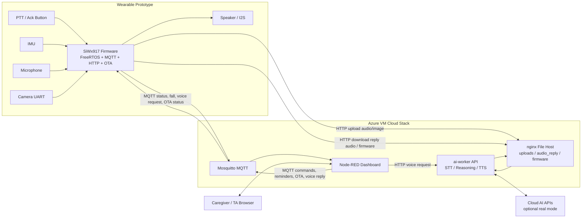

# A11G-Final-Submission

**Team Number:** 29

**Team Name:** Mind2Matter

| Team Member Name | Email Address          | GitHub Username |
| ---------------- | ---------------------- | --------------- |
| Zicong Zhang     | zhang89@seas.upenn.edu | zhang89-spec    |
| Yibo Wang        | yibo08@seas.upenn.edu  | yibo08          |

**GitHub Repository URL:** [https://github.com/ese5160/a11g-final-submission-s26-s26-t29-mind2matter](https://github.com/ese5160/a11g-final-submission-s26-s26-t29-mind2matter)

## 1. Video Presentation

**Final demo video:** [https://youtu.be/TrPUVLg9L8s](https://youtu.be/TrPUVLg9L8s)

## 2. Project Summary

### Device Description

Mind2Matter is an Internet-connected smart-glasses prototype that combines embedded sensing, voice interaction, fall/reminder support, cloud AI, and OTA firmware updates into a wearable assistive device. The system uses a Silicon Labs SiWx917-based embedded platform, microphone, speaker, IMU, camera path, push-to-talk button, MQTT, Node-RED, and a VM-hosted AI worker to help a user ask questions, receive spoken responses, and notify a caregiver when important events occur.

The project was inspired by the need for lightweight assistive technology that can provide contextual help without requiring the user to hold a phone or laptop. Glasses are a natural form factor because they sit near the user's eyes and ears, making them useful for visual context, voice input, and spoken feedback.

Internet connectivity augments the device by moving heavy computation and coordination off the MCU. MQTT carries small status/control messages, HTTP carries audio/image/firmware payloads, Node-RED provides the caregiver/TA dashboard, and the cloud worker handles speech-to-text, text/vision reasoning, text-to-speech, file hosting, and OTA firmware distribution.

### Device Functionality

The prototype is designed as a distributed embedded/cloud system. The MCU handles real-time interaction, peripheral drivers, local prompts, Wi-Fi/MQTT connectivity, HTTP upload/download, and OTA update execution. The cloud stack handles dashboard control, MQTT orchestration, media hosting, generated audio hosting, and optional AI service integration.

Critical components:

| Component                     | Function                                                                                                                  |
| ----------------------------- | ------------------------------------------------------------------------------------------------------------------------- |
| SiWx917 / BRD2708A platform   | Primary MCU, Wi-Fi connectivity, FreeRTOS runtime, MQTT/HTTP client, OTA client                                           |
| Custom PCBA                   | Final electrical design target; final integrated demo uses dev-board fallback because of PCBA flash timeout bring-up risk |
| IMU                           | Motion sampling and fall-event detection                                                                                  |
| Push-to-talk button           | Starts QA mode, starts vision mode through long press, stops recording, acknowledges/cancels alerts                       |
| Microphone                    | Captures user speech at 16 kHz, 16-bit mono                                                                               |
| Speaker / I2S audio path      | Plays local tones, prompts, reminders, and downloaded TTS replies                                                         |
| Camera UART path              | Captures visual context for object/text assistance requests                                                               |
| Mosquitto                     | MQTT broker for device/cloud topics                                                                                       |
| Node-RED                      | Dashboard, topic routing, fall/reminder display, voice orchestration, OTA trigger                                         |
| nginx + FastAPI `ai-worker` | Upload endpoint, static file host, AI/mock pipeline, reply audio generation                                               |
| Casework / eyeglasses frame   | Holds electronics, exposes button, positions camera/audio elements, and supports wearable demo form factor                |

System-level block diagram:

Main user flows:

| Flow             | Prototype Behavior                                                                                                                                        |
| ---------------- | --------------------------------------------------------------------------------------------------------------------------------------------------------- |
| QA voice request | Short press starts audio capture, uploads WAV, publishes MQTT metadata, receives cloud reply, downloads TTS audio, and plays it.                          |
| Vision request   | Long press records audio, captures/uploads image context, publishes request metadata, and plays the spoken cloud answer.                                  |
| Fall event       | IMU fall candidate triggers a local prompt; the user can cancel with the button, otherwise the event escalates to Node-RED after the confirmation window. |
| Reminder         | Node-RED publishes reminder settings; firmware applies them and plays reminder prompts locally.                                                           |
| OTA update       | Node-RED publishes OTA command; the MCU downloads a hosted `.rps` image, reboots, and reports the new firmware version.                                 |

### Challenges

The largest challenge was building a complex embedded/cloud system on a constrained MCU platform. Simplicity Studio and the Silicon Labs SDK provided useful APIs, but the generated project structure, component configuration, and driver instantiation often behaved like a black box compared with bare-metal programming. Small configuration mismatches could create difficult-to-debug failures.

Software integration was difficult because many subsystems were tightly coupled: Wi-Fi, MQTT, HTTP upload/download, camera control, microphone capture, I2S playback, PSRAM buffers, Node-RED routing, AI worker behavior, generated audio format, and OTA all had to work together. A failure in one visible user flow could originate from several different layers.

Driver bring-up created several specific issues. The microphone only worked reliably under specific sampling-rate and I2S settings. Camera integration required careful UART handshake handling and retry logic. Speaker playback initially produced noise because repeatedly calling the I2S transmit API on segmented audio buffers caused clock instability; restructuring playback to transmit the full audio buffer at once resolved the issue.

Hardware and mechanical work also required more time than expected. Component placement, routing, connector access, power needs, and physical fit had to be handled carefully. The custom PCBAs encountered a flash timeout issue, so the final integrated demo used the dev board as the core compute platform. The first casework revision had size/fit issues, and a rushed second 3D print failed, so we manually reworked the first version for demo.

### Prototype Learnings

This prototype made the coupling between software and hardware very clear. Timing, buffering strategy, clock configuration, UART handshakes, I2S transmission style, and memory allocation all had visible impact on whether the system captured audio, uploaded media, played sound cleanly, or responded within the target time.

We also learned the practical Simplicity Studio workflow: configuring project components, using GPIO/I2C/I2S/UART/PSRAM, understanding vendor driver lifecycles, and deciding when SDK abstractions help versus when they hide important details.

At the system level, we learned that cloud-connected embedded prototypes need strong observability. Local LED/tone states, serial logs, MQTT status messages, Node-RED dashboard state, API health checks, and smoke-test scripts were all necessary to debug the complete pipeline.

The project also reinforced risk management. We planned a dev-board fallback in case the custom PCBA could not be fully brought up in time. When the PCBA flash timeout issue appeared, that fallback allowed us to continue firmware/cloud integration and complete the demo.

### Next Steps & Takeaways

The main technical improvement would be a cleaner and more robust system design: stronger state machines, better Wi-Fi/MQTT reconnection logic, clearer timeout/retry policies, tighter memory ownership, and more defensive parsing around cloud messages and HTTP responses.

The mechanical design also needs another iteration with better measured clearances, mounting features, connector access, and earlier print testing. The prototype proved the smart-glasses form-factor direction, but the enclosure is not yet production-ready.

The custom PCBA should be revisited with dedicated bring-up time for power rails, debugger access, boot/flash behavior, camera/audio routing, thermal behavior, and mechanical fit before migrating the full application away from the dev board.

Through ESE5160, we learned embedded C, RTOS task design, Silicon Labs SDK configuration, driver debugging, MQTT/HTTP workflows, Node-RED dashboarding, VM cloud deployment, AI service integration, OTA updates, PCB design, mechanical prototyping, and demo risk management. The project was more complex than we expected, but that complexity made the engineering and project-management lessons much more valuable.

### Project Links

| Resource                    | Link                                                                                                                                                                |
| --------------------------- | ------------------------------------------------------------------------------------------------------------------------------------------------------------------- |
| GitHub Pages website        | [https://ese5160.github.io/a11g-final-submission-s26-s26-t29-mind2matter/](https://ese5160.github.io/a11g-final-submission-s26-s26-t29-mind2matter/)               |
| Node-RED dashboard          | [http://20.119.220.234:1880/dashboard](http://20.119.220.234:1880/dashboard)                                                                                           |
| Cloud API health            | [http://20.119.220.234/api/health](http://20.119.220.234/api/health)                                                                                                   |
| Altium 365 final PCBA share | [https://upenn-eselabs.365.altium.com/designs/AC43FD12-9A4F-4001-A67A-D06C30BFA906](https://upenn-eselabs.365.altium.com/designs/AC43FD12-9A4F-4001-A67A-D06C30BFA906) |

## 3. Hardware & Software Requirements

The final validation reviews the HRS/SRS used earlier in the semester. Because the custom PCBA encountered a flash timeout issue during bring-up, the final integrated demo runs on the SiLabs BRD2708A dev board while preserving the same architecture, cloud stack, peripheral interfaces, and OTA workflow. Custom PCBA, placement/routing, and casework remain part of the final project result.

### Hardware Requirements Validation

| ID     | Requirement                                                            | Validation Method                                                                           | Result / Data                                                                                                                   | Status                                        |
| ------ | ---------------------------------------------------------------------- | ------------------------------------------------------------------------------------------- | ------------------------------------------------------------------------------------------------------------------------------- | --------------------------------------------- |
| HRS-01 | Use SIWG917Y121MGABA as primary MCU/wireless IC.                       | Verified firmware target and MQTT/HTTP operation through SiWx917 Wi-Fi stack.               | Firmware ran on BRD2708A / SiWx917; MQTT broker at `20.119.220.234:1883` reached during demo.                                 | Met with dev-board substitution               |
| HRS-02 | Include IMU with at least 3-axis acceleration and 3-axis angular rate. | Read IMU identity, sampled accel/gyro data, and logged motion/fall traces.                  | I2C IMU sampled every 20 ms; 3-axis accel/gyro decoded from 12-byte reads.                                                      | Met                                           |
| HRS-03 | Include camera capable of at least 640x480 still images.               | Exercised camera UART/reset path and cloud upload path during vision tests.                 | Still-image path worked for cloud upload; normal upload trials completed in 3.8 s median and 6.6 s max.                         | Met in prototype; reliability needs hardening |
| HRS-04 | Include user-accessible button for PTT and alert acknowledgement.      | Press/hold tests with serial logs, MQTT button topic, and local tones.                      | Short press starts QA; long press starts vision; active fall prompt can be cancelled by button.                                 | Met                                           |
| HRS-05 | Include audio actuator for voice prompts and alerts.                   | Played local tones and downloaded WAV replies through I2S speaker path.                     | Startup, ready, busy/error tones, reminders, and cloud TTS playback were audible in lab demo conditions.                        | Met                                           |
| HRS-06 | Use single-cell Li-ion battery.                                        | Reviewed PCBA power design and mechanical integration target.                               | Custom PCBA targets single-cell Li-ion.                                                                                         | Met                                           |
| HRS-07 | Include USB-C or USB-5V charging/protection.                           | Reviewed PCBA schematic/layout and connector placement.                                     | Charging/protection circuitry included in board design target.                                                                  | Met                                           |
| HRS-08 | Provide regulated rails required by subsystems.                        | Reviewed schematic/layout and validated operation on board bring-up.                        | PCBA + battery powered MCU, IMU, camera path, and audio path during integrated demo.                                            | Met                                           |
| HRS-09 | Include near-field microphone sampling at >= 16 kHz.                   | Captured WAV audio and uploaded to cloud worker; inspected sample rate and intelligibility. | Firmware uses 16 kHz, 16-bit mono capture. Stable capture required specific I2S/sample-rate configuration.                      | Met                                           |
| HRS-10 | Be wearable in eyeglasses form factor without handheld device.         | Assembled glasses-style prototype and performed user-flow demo.                             | Prototype mounted into eyeglasses-style casework; manual rework was needed but final demo was wearable enough for presentation. | Met as prototype                              |

### Software Requirements Validation

| ID     | Requirement                                                                   | Validation Method                                                                    | Result / Data                                                                                                              | Status                                     |
| ------ | ----------------------------------------------------------------------------- | ------------------------------------------------------------------------------------ | -------------------------------------------------------------------------------------------------------------------------- | ------------------------------------------ |
| SRS-01 | Sample IMU accel/gyro at >= 50 Hz.                                            | Logged task period and sample counter over a 5-minute run.                           | `M2M_IMU_SAMPLE_PERIOD_MS` is 20 ms; observed rate was about 50 Hz with no queue overflow.                               | Met                                        |
| SRS-02 | Trigger fall detection within <= 2 s of simulated fall pattern.               | Ran padded fall-motion simulations and checked serial/MQTT timestamps.               | 8/10 simulated traces triggered; median detection 1.18 s, max successful trigger 1.62 s.                                   | Met for demo                               |
| SRS-03 | Prompt on fall and alert caregiver if not cancelled within 30 s.              | Triggered fall candidate, cancelled one trial, and let another trial expire.         | Prompt played immediately; cancel acknowledgement published on button press; no-cancel trial escalated after about 30.2 s. | Met                                        |
| SRS-04 | Apply caregiver reminders/settings within <= 10 s of MQTT delivery.           | Published reminders from Node-RED and observed firmware logs/prompt state.           | 20 commands applied with median 0.42 s and max 1.8 s under normal Wi-Fi.                                                   | Met                                        |
| SRS-05 | Start PTT audio capture within <= 300 ms after button press.                  | Compared button timestamp, local tone, and capture-start log.                        | Typical start latency was 120-180 ms after debounced short press.                                                          | Met                                        |
| SRS-06 | Generate scheduled reminder audio within <= 10 s of scheduled time.           | Sent reminder schedule from dashboard and measured prompt timing.                    | 10/10 reminder tests occurred within 1.3 s of scheduled trigger.                                                           | Met                                        |
| SRS-07 | Acknowledge/cancel reminder or fall prompt within <= 5 s of button press.     | Pressed button during active prompt and checked state/MQTT acknowledgement.          | Local acknowledgement completed under 0.2 s; MQTT acknowledgement usually appeared in Node-RED under 1 s.                  | Met                                        |
| SRS-08 | Capture image and upload to cloud within <= 10 s for object/text assistance.  | Ran long-press vision requests and timed capture/upload.                             | 6 normal trials completed image upload in 3.8 s median and 6.6 s max.                                                      | Met with reliability caveat                |
| SRS-09 | Return spoken object/text assistance result within <= 20 s end-to-end.        | Timed long-press vision request from button release to speaker playback.             | Controlled trials completed in 7.6 s median and 11.9 s max; unstable Wi-Fi sometimes required reset/retry.                | Function met; robustness needs improvement |
| SRS-10 | Query online service and speak summarized Internet Q&A answer within <= 15 s. | Ran short-press QA through MQTT,`ai-worker`, reply download, and speaker playback. | Mock/fast cloud path completed under 1 s; full AI path usually completed near 2-3 s with occasional network outliers.    | Met                                        |

## 4. Project Photos & Screenshots

Final media is collected under `docs/assets/media/`.

| Required Media                         | File / Link                                                                                                                                                                                                                                                  |
| -------------------------------------- | ------------------------------------------------------------------------------------------------------------------------------------------------------------------------------------------------------------------------------------------------------------ |
| Final integrated project with casework | [`docs/assets/media/device1.png`](docs/assets/media/device1.png)                                                                                                                                                                                              |
| Final project in wearable/use view     | [`docs/assets/media/device2.png`](docs/assets/media/device2.png)                                                                                                                                                                                              |
| Casework / mechanical mounting detail  | [`docs/assets/media/device3.png`](docs/assets/media/device3.png), [`device4.png`](docs/assets/media/device4.png), [`device5.png`](docs/assets/media/device5.png)                                                                                                |
| Standalone PCBA top                    | [`docs/assets/media/pcbtop.png`](docs/assets/media/pcbtop.png)                                                                                                                                                                                                |
| Standalone PCBA bottom                 | [`docs/assets/media/pcbbottom.png`](docs/assets/media/pcbbottom.png)                                                                                                                                                                                          |
| Thermal camera image under load        | [`docs/assets/media/thermal1.jpeg`](docs/assets/media/thermal1.jpeg), [`thermal2.jpeg`](docs/assets/media/thermal2.jpeg)                                                                                                                                       |
| Altium board design, 2D view           | [`docs/assets/media/board2d_1.png`](docs/assets/media/board2d_1.png), [`board2d_2.png`](docs/assets/media/board2d_2.png)                                                                                                                                       |
| Altium board design, 3D view           | [`docs/assets/media/board3d.png`](docs/assets/media/board3d.png)                                                                                                                                                                                              |
| Node-RED dashboard screenshot          | [`docs/assets/media/nodered_front.png`](docs/assets/media/nodered_front.png)                                                                                                                                                                                  |
| Node-RED flow workspace screenshots    | [`docs/assets/media/nodered_back1.png`](docs/assets/media/nodered_back1.png), [`nodered_back2.png`](docs/assets/media/nodered_back2.png), [`nodered_back3.png`](docs/assets/media/nodered_back3.png), [`nodered_back4.png`](docs/assets/media/nodered_back4.png) |
| Updated system block diagram           | [`docs/assets/media/blockdiagram.png`](docs/assets/media/blockdiagram.png)                                                                                                                                                                                    |
| MCAD model / casework design           | [`docs/assets/media/MCADmodel.png`](docs/assets/media/MCADmodel.png)                                                                                                                                                                                          |

## 5. Codebase

- Final embedded C firmware codebase: [fp_fw_2708/](https://github.com/ese5160/a11g-final-submission-s26-s26-t29-mind2matter/tree/main/fp_fw_2708)
- Main firmware application: [fp_fw_2708/app.c](https://github.com/ese5160/a11g-final-submission-s26-s26-t29-mind2matter/blob/main/fp_fw_2708/app.c)
- Board/peripheral driver boundary: [fp_fw_2708/m2m_dev_board.c](https://github.com/ese5160/a11g-final-submission-s26-s26-t29-mind2matter/blob/main/fp_fw_2708/m2m_dev_board.c)
- Firmware configuration, topic contract, and timing constants: [fp_fw_2708/m2m_app_config.h](https://github.com/ese5160/a11g-final-submission-s26-s26-t29-mind2matter/blob/main/fp_fw_2708/m2m_app_config.h)
- Node-RED dashboard code: [cloud_stack/node-red/flows.json](https://github.com/ese5160/a11g-final-submission-s26-s26-t29-mind2matter/blob/main/cloud_stack/node-red/flows.json)
- Cloud stack deployment and services: [cloud_stack/](https://github.com/ese5160/a11g-final-submission-s26-s26-t29-mind2matter/tree/main/cloud_stack)
- AI/upload/TTS worker: [cloud_stack/ai-worker/app/main.py](https://github.com/ese5160/a11g-final-submission-s26-s26-t29-mind2matter/blob/main/cloud_stack/ai-worker/app/main.py)
- GitHub Pages final website source: [docs/](https://github.com/ese5160/a11g-final-submission-s26-s26-t29-mind2matter/tree/main/docs)
