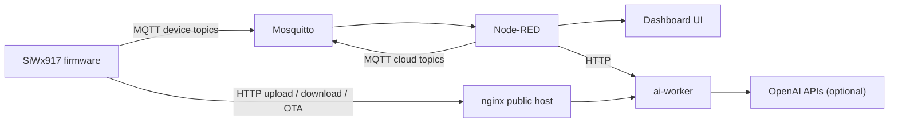

# Mind2Matter Cloud Stack

This folder contains the deployable cloud side of the Mind2Matter system. It packages the MQTT broker, Node-RED dashboard and orchestration flows, public HTTP hosting, and the `ai-worker` API into a single Docker Compose stack suitable for demos, checkoff, and submission.

## What This Stack Does

- Terminates all device/cloud MQTT traffic through Mosquitto
- Hosts the caregiver / TA dashboard in Node-RED
- Publishes cloud-originated commands such as reminders, LED control, voice replies, system notices, and OTA triggers
- Hosts OTA firmware images, uploaded media, and generated reply audio over HTTP
- Exposes an API layer for upload, reasoning, and TTS orchestration

## Service Layout

| Service | Port | Purpose |
|---------|------|---------|
| `mosquitto` | `1883` | MQTT broker for device/cloud topics |
| `node-red` | `1880` | Dashboard UI and flow orchestration |
| `nginx` | `80` | Public file hosting and reverse proxy for `/api/*` |
| `ai-worker` | internal `8000` | Upload, reasoning, and speech generation API |

## Runtime Workflow



## Directory Layout

```text
cloud_stack/
├── ai-worker/
├── mosquitto/
├── nginx/
├── node-red/
├── public/
│   ├── audio_reply/
│   ├── firmware/
│   └── uploads/devkit/
├── scripts/
├── docker-compose.yml
└── .env.example
```

## Deployment

### VM Prerequisites

Open these inbound ports on the target VM:

- `22/tcp` for SSH
- `80/tcp` for HTTP file hosting and `/api/*`
- `1880/tcp` for Node-RED editor and dashboard
- `1883/tcp` for MQTT

If the VM is fresh Ubuntu, the bootstrap script can install Docker and open the common ports:

```bash
cd ~/FinalProject/cloud_stack
chmod +x scripts/bootstrap_vm.sh
./scripts/bootstrap_vm.sh
```

### Start the Stack

```bash
cd ~/FinalProject/cloud_stack
cp .env.example .env
docker compose up -d --build
```

Recommended `.env` values for the current deployment:

- `PUBLIC_IP=20.119.220.234`
- `PUBLIC_BASE_URL=http://20.119.220.234`
- `AI_MOCK_MODE=true` for pipeline-only demos
- `AI_MOCK_MODE=false` plus `OPENAI_API_KEY=...` for real STT + reasoning + TTS

### Validate the Deployment

```bash
docker compose ps
curl http://20.119.220.234/
curl http://20.119.220.234/api/health
```

## Public Endpoints

- Node-RED editor: `http://20.119.220.234:1880/`
- Node-RED dashboard: `http://20.119.220.234:1880/dashboard`
- Firmware hosting: `http://20.119.220.234/firmware/`
- Upload directory: `http://20.119.220.234/uploads/devkit/`
- Generated reply audio: `http://20.119.220.234/audio_reply/`
- API health: `http://20.119.220.234/api/health`

## Topic Ownership

Device-originated topics:

- `mind2matter/device/glasses01/status`
- `mind2matter/device/glasses01/event/fall`
- `mind2matter/device/glasses01/reminder/ack`
- `mind2matter/device/glasses01/debug/button`
- `mind2matter/device/glasses01/voice/request`
- `mind2matter/device/glasses01/ota/status`

Cloud-originated topics:

- `mind2matter/cloud/glasses01/debug/led/set`
- `mind2matter/cloud/glasses01/reminder/set`
- `mind2matter/cloud/glasses01/voice/reply`
- `mind2matter/cloud/glasses01/system/notice`
- `mind2matter/cloud/glasses01/ota/update`

## Workflow by Feature

### Dashboard and Telemetry

1. The device publishes state and events to Mosquitto.
2. Node-RED subscribes to those topics and updates dashboard widgets.
3. Dashboard actions publish cloud commands back to the device.

### Voice Request / AI Reply

1. The MCU uploads audio or image data over HTTP.
2. The MCU publishes a `voice/request` metadata message over MQTT.
3. Node-RED forwards that request to `ai-worker`.
4. `ai-worker` performs transcription, reasoning, and TTS.
5. Reply audio is saved under `public/audio_reply/`.
6. Node-RED publishes a `voice/reply` MQTT message with the final `audio_url`.

### OTA Firmware Update

1. Place the firmware image into `public/firmware/`.
2. The dashboard publishes `mind2matter/cloud/glasses01/ota/update`.
3. The device downloads the hosted `.rps` over HTTP.
4. The MCU reboots into the new image and reports its updated firmware version.

## Firmware Publishing

Publish a built `.rps` artifact with:

```bash
cd ~/FinalProject/cloud_stack
./scripts/publish_firmware.sh /path/to/fp_fw_2708.rps fp_fw_2708_v2.rps
```

The resulting public URL will be:

```text
http://20.119.220.234/firmware/fp_fw_2708_v2.rps
```

In the dashboard OTA control, use the relative resource path:

```text
firmware/fp_fw_2708_v2.rps
```

## Validation Scripts

Useful smoke tests in `scripts/`:

- `api_smoke_test.sh`
- `vision_smoke_test.sh`
- `mqtt_smoke_test.sh`
- `download_ai_audio.sh`

These validate the cloud path independently from the full hardware demo.

## Release vs Local Debug Notes

- This README is the submission-oriented release document for the cloud stack.
- Local debug notes can be kept as `*.local.md` files and are ignored by Git.
